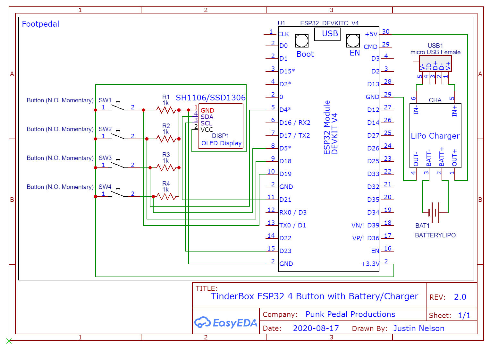

# Sparky 
Bluetooth "Universal Remote" Foot pedal for Digital Guitar Amps, on ESP32. I originally built Justin Nelsons tinderbox pedal for my spark amp. I wanted to take it to the next level and allow more than just flipping through 4 presets. This is a merge of Justin's idea with the Spark Amp Foot Pedal V1. Build the pedal exactly how Justin has it and then use this code to expand on his idea.

https://github.com/jrnelson90/tinderboxpedal

https://blog.studioblip.com/guitar/amps/spark/footpedalV1/

There has been talk of Justin building his version of the pedals for sale on https://www.facebook.com/groups/241616417119881  If you purchase one from him and want to use this you should be able to flash the pedal with this code to open up this functionality. Check to make sure that the pinouts have not changed in his repo before you do.
## Environment Setup Notes:
* So far only tested with the Positive Grid Spark 40 Amp
* **ESP32 Setup:** https://github.com/jrnelson90/tinderboxpedal/wiki/ESP32-Arduino-Core-Setup-for-TinderBox-ESP-v0.3.1
* **Please check your specific ESP32 dev board pinouts if attempting to use this version.**

## Functionality
This update allows the user to change the spark amp through a foot pedal to 18 diffrent tones. It also allows you to toggle your Over Drive, Reverb, Mod and Delay Pedals
The tone list is updatable and will be built on over time.
## Current Tone List

1.  Bang Bang : Twin with Tremolo for the Nancy Sinatra classic, use with humbucker neck pickup *Decoded by Morgan West*
2.  BB King : Strat position 8 works nicely (see 10 switch mod for Strat article soon...). Also good for Johnny B. Goode intro. *Decoded by Morgan West*
3.  Better Call Saul : Based on the theme tune by Little Barrie. Use humbucker both pickups for in between sound. *Decoded by Morgan West*
4.  Breezy Blues - Positive Grid default preset. *Decoded by Morgan West*
5.  Bright Tweed - Positive Grid default preset. *Decoded by Morgan West*
6.  Dancing In A Room - Attempt at the John Mayer Strat pos 4 sound. *Decoded by Morgan West*
7.  Fuzzy Jam - Positive Grid default preset, good for the Eels Dog Faced Boy, use neck pickup. *Decoded by Morgan West*
8.  Hendrix - Purpley and Hazely, bombastic with strat neck pickup. *Decoded by Morgan West*
9.  Irish One - Homage to 8-dotted delay-tastic Edgeness. *Decoded by Morgan West*
10. Le Freak - Nile Rodgers clean funk rhythm - use Strat pos 2. *Decoded by Morgan West*
11. Red Hot Chilli Peppers - Frusciante's Under the Bridge clean Strat neck sound. *Decoded by Morgan West*
12. Santana - Samba Pa Ti. *Decoded by Morgan West*
13. Silver Ship - Positive Grid default preset. *Decoded by Morgan West*
14. Spooky Melody - Positive Grid default preset. *Decoded by Morgan West*
15. Stray Cat Strut - Brian Setzer slapped-back and cookin' - position 8 for Strat. *Decoded by Morgan West*
16. Sultans of Swing - Swing with Knopfler - use Strat pos 2. *Decoded by Morgan West*
17. Surf - AC 30 gritty, tremolo and plenty of reverb, use with single coil bridge pickup. Good for Rumble by Link Wray. *Decoded by Morgan West*
18. Whole Lotta Love - Pagey style for rocking riffs. *Decoded by Morgan West*
## Instructions
Button 1: Toggle OverDrive.
Button 2: Toggle Mod.
Button 3: Toggle Delay.
Button 4: Toggle Reverb.

**Hold Button 1 for 1 second to enter tone select mode.**

**Tone Select Mode Buttons**
Button 1: Hold for 1 second to save selection to amp and exit tone select mode.
Button 2: Previous Tone.
Button 3: Next Tone.
Button 4: Hold for 1 second to exit tone select mode without saving.
### ESP32 Schematic
**In this code pins 4, 5, 18, and 19 are used for button input. Your ESP32 dev board's GPIO layout may be different, so please double-check after wiring and before running!**
Drawing By Justin Nelson.

## Other great projects used in the Sparky Pedal include:

### ESP32
* ESP32 Arduino-Core:  https://github.com/espressif/arduino-esp32
* Thingpulse SSD1306/SH1106 ESP Driver: https://github.com/ThingPulse/esp8266-oled-ssd1306
* ButtonFever: https://github.com/mickey9801/ButtonFever

### Wireless Sniffing
* Wireshark: https://github.com/wireshark/wireshark

## License

Copyright 2020 Sparky Pedal Project and Christopher Smashe

Licensed under the Apache License, Version 2.0 (the "License");
you may not use this file except in compliance with the License.
You may obtain a copy of the License at

    http://www.apache.org/licenses/LICENSE-2.0

Unless required by applicable law or agreed to in writing, software
distributed under the License is distributed on an "AS IS" BASIS,
WITHOUT WARRANTIES OR CONDITIONS OF ANY KIND, either express or implied.
See the License for the specific language governing permissions and
limitations under the License.
